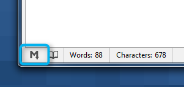
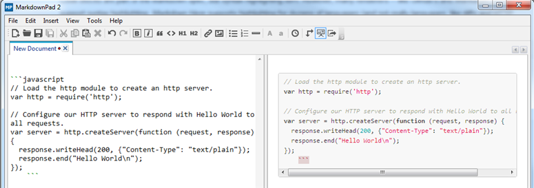

# Chapter 9: Advanced Markdown

## Code Blocks

### Enabling syntax highlighting for programming languages

[Syntax highlighting](http://en.wikipedia.org/wiki/Syntax_highlighting) is a valuable tool used by software developers, which helps make source code easier to read and understand. 

> Note: Syntax highlighting is not included in the original Markdown language specification, but Markdown processors like [GitHub Flavored Markdown](7-1-github-flavored-markdown.md) have added support for this feature.


#### Step 1: Select the GitHub Flavored Markdown processor

The easiest way to do this is to click the **M** icon in the bottom left side of the status bar, then select **GitHub Flavored Markdown**.



#### Step 2: Wrap the code block with Fenced Code Block syntax

In GitHub Flavored Markdown, code blocks can be wrapped with three backticks (```) to create a "fenced code block". 

For example:

	```
	// Load the http module to create an http server.
	var http = require('http');
	
	// Configure our HTTP server to respond with Hello World to all requests.
	var server = http.createServer(function (request, response) {
	  response.writeHead(200, {"Content-Type": "text/plain"});
	  response.end("Hello World\n");
	});
	```

### Step 3: Specify the programming language

The final step is to specify which language you're using, which must be included immediately after the opening Fenced Code Block.

For JavaScript:

 	```javascript
	// Load the http module to create an http server.
	var http = require('http');
	
	// Configure our HTTP server to respond with Hello World to all requests.
	var server = http.createServer(function (request, response) {
	  response.writeHead(200, {"Content-Type": "text/plain"});
	  response.end("Hello World\n");
	});
	```

This produces the result:

 

### Supported Languages

To see a list of supported languages, check out the [Highlight.js demo page](http://highlightjs.org/static/test.html).
